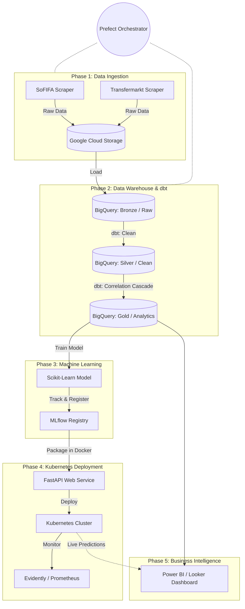

# Architecture Blueprint: FIFA Wonderkid MLOps Platform

This document outlines the high-level system architecture and data flow for the Analytics FC platform.

```mermaid
flowchart TD
    %% Orchestration
    O((Prefect Orchestrator)) -.- Phase1
    O -.- Phase2

    %% Phase 1: Ingestion
    subgraph Phase1 [Phase 1: Data Ingestion]
        A[SoFIFA Scraper] -->|Raw Data| C[(Google Cloud Storage)]
        B[Transfermarkt Scraper] -->|Raw Data| C
    end

    %% Phase 2: Data Engineering
    subgraph Phase2 [Phase 2: Data Warehouse & dbt]
        C -->|Load| D[(BigQuery: Bronze / Raw)]
        D -->|dbt: Clean| E[(BigQuery: Silver / Clean)]
        E -->|dbt: Correlation Cascade| F[(BigQuery: Gold / Analytics)]
    end

    %% Phase 3: Machine Learning
    subgraph Phase3 [Phase 3: Machine Learning]
        F -->|Train Model| G[Scikit-Learn Model]
        G -->|Track & Register| H[MLflow Registry]
    end

    %% Phase 4: Deployment & Serving
    subgraph Phase4 [Phase 4: Kubernetes Deployment]
        H -->|Package in Docker| I[FastAPI Web Service]
        I -->|Deploy| K8S[Kubernetes Cluster]
        K8S -->|Monitor| J[Evidently / Prometheus]
    end

    %% Phase 5: Dashboard
    subgraph Phase5 [Phase 5: Business Intelligence]
        F --> K[Power BI / Looker Dashboard]
        K8S -.->|Live Predictions| K
    end
```
